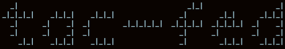

# tac-fed


## About
Utility to assist in the movement of helm charts and container images from Tanzu Application Catalog (TAC) to an offline registry. This is currently tested on Arch Linux, RHEL 7.X and MacOS Big Sur.
## Getting started
Install all of the tools in the [Requisite tooling](#requisite-tooling) section

Credentials are composed into distinct authentication files for push and pull operations using the [dockerconfigjson format](https://kubernetes.io/docs/tasks/configure-pod-container/pull-image-private-registry/#log-in-to-docker).
- Pull operations leverage `registry.pivotal.io` and credentials are persisted to `tac-auth.json`
- Push operations leverage your private registry and credentials are persisted to `private-registry-auth.json`

Authentication files are generated on the first execution of this script and will be used for subsequent executions. You **must** know the robot credentials that were provided to you as part of your TAC license agreement, and you **must** possess the credentials to your private registry _if_ you want to synchronize images to it.

**NOTES**:
* A cache directory is persisted to `~/tac-fed` by default; manipulate this path via [environment variables](#environment-variables).
* Image transfer is generally slow due to serial requests to transfer images.
* This project does **_not_** aim to be a tool for uploading charts; [charts-syncer](https://github.com/bitnami-labs/charts-syncer) is better suited for those needs.

## Requisite tooling
`tac-fed` depends on the following tools:
* `base64`
* [helm](https://helm.sh/)
* [jq](https://stedolan.github.io/jq/)
* [oras](https://github.com/oras-project/oras)
* [skopeo](https://github.com/containers/skopeo)

## Usage
This command relies on being run from the directory that you cloned this Git repo into, due to its dependence on helper functions. This will be bundled for easy installation at a later date.

Providing the `--repository` option to the `image_pull` and the `chart_pull` commands is mandatory!

```console
USAGE: ./tac-fed COMMAND [OPTS]

COMMANDS:
* chart_pull: pull all of the latest charts that you are entitled to in TAC
* image_pull: pull all of the latest container images that you are entitled to in TAC
* image_push: synchronize a local directory of container images to TAC
* clean: expunge the charts and images that are created by this tool
* help: print this usage text and exit

GLOBAL OPTS:
* --help: print this usage text and exit

PULL OPTS:
* --repository: your tac repository (e.g. 'tac-federal-customer', if using registry.pivotal.io/tac-federal-customer)

PUSH OPTS:
* --destination: your private registry and path (e.g. harbor.your.private.domain/tac)

ENV:
* TAC_CACHE_DIR: location to save charts, container images and TAC authentication file (current: /home/foo/tac-fed). This also controls the location of images and an authentication file for pushing images to a remote, private registry.
* TAC_FED_DEBUG: enable debug mode (set -x).

EXAMPLES:
    ./tac-fed clean
    ./tac-fed image_pull --repository=tac-federal-customer
    ./tac-fed chart_pull --repository=tac-federal-customer
    ./tac-fed image_push --destination=harbor.your.private.domain/tac
```

### Environment variables
The destination directory can currently be controlled via the `TAC_CACHE_DIR` environment variable prior to executing `tac-fed`. Ensure that the destination directory is adequately sized; `image_pull` operations can exceed 50GiB in size (depending on your entitlements).

```bash
TAC_CACHE_DIR=/tmp/tac-fed
export TAC_CACHE_DIR
```

If you need to debug `tac-fed`, you can enable "debug" mode by setting `TAC_FED_DEBUG=true`.
```bash
TAC_FED_DEBUG=true
export TAC_FED_DEBUG
```